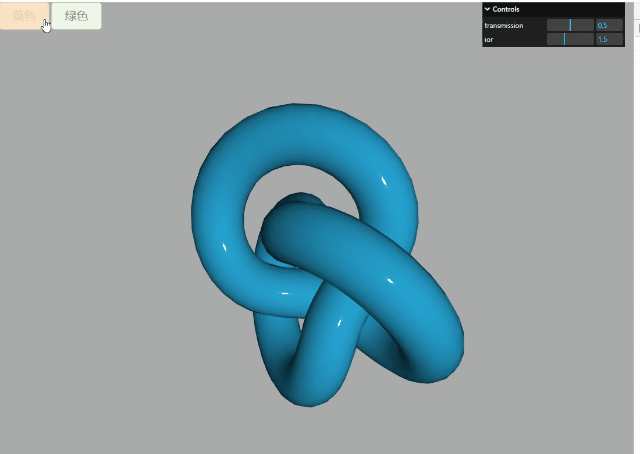
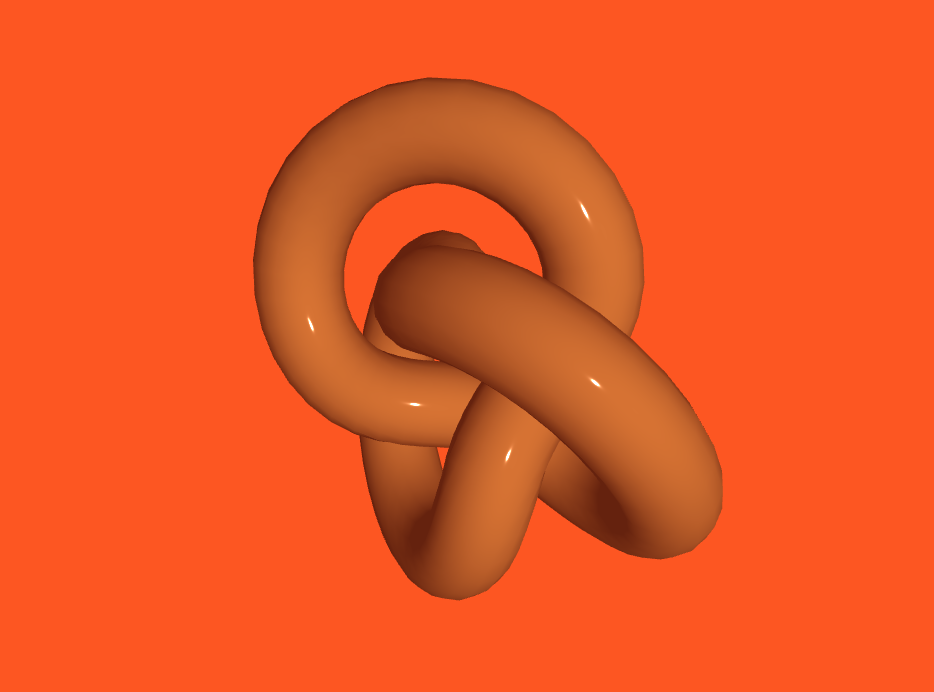
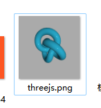

## 画布全屏以及自定义大小画布

```html
<!-- canvas元素默认是行内块元素 -->
<div
  class="model"
  style="background-color: #ff0000;"
  width="300"
  height="180"
></div>
```

画布随窗口变化

```js
// 画布跟随窗口变化
window.onresize = function () {
  const width = window.innerWidth - "多余的宽度"; //model画布高度
  const height = window.innerHeight - "多余的高度"; //model画布宽度
  renderer.setSize(width, height);
  camera.aspect = width / height;
  camera.updateProjectionMatrix();
};
```

## UI 交互按钮与 3D 场景交互

通过按钮点击事件设置模型颜色,我这里使用 element-plus 的按钮

```html
<el-button class="yellow-btn" type="warning" plain @click="yellowBtn"
  >黄色</el-button
>
```

```js
const yellowBtn = () => {
  console.log(mesh);
  mesh.material.color.set(0xe5a144);
};
```

效果：


## 背景透明度

#### `.setClearAlpha()方法`

```js
renderer.setClearAlpha(0.0); // 完全透明
```

#### 设置背景透明`alpha: true`

```js
// 在构造函数参数中设置alpha属性的值
var renderer = new THREE.WebGLRenderer({
  alpha: true,
});
```

#### `.setClearColor()方法`

`.setClearColor()`方法的参数 2，可以用来设置背景颜色透明度。

```js
renderer.setClearColor(0xb9d3ff, 0.4); //设置背景颜色和透明度
```

这里我给创建画布的 div 添加一个背景颜色

```css
.container {
  width: 100%;
  height: 100vh;
  position: relative;
  z-index: 1;
  background: #ff5810;
}
```

模型背景需要删掉

```js
// scene.background = new THREE.Color(0xaaaaaa);
```

这时模型的背景会变成透明，适应 div 的背景


## 渲染结果保存为图片

```html
<el-button class="save-btn" @click="saveFile">下载</el-button>
```

```js
const saveFile = () => {
  const link = document.createElement("a");
  // 通过超链接herf属性，设置要保存到文件中的数据
  link.href = window.URL.createObjectURL(
    new Blob([JSON.stringify(scene), JSON.stringify(mesh)])
  );
  link.download = "模型数据.txt"; //下载文件名
  link.click(); //js代码触发超链接元素a的鼠标点击事件，开始下载文件到本地
};
```

**下载完成后会生成一个 txt 文档，内容里是放一些场景的属性以及模型的信息**

### 1. 配置 webgl 渲染器`preserveDrawingBuffer:true`

```js
// WebGL渲染器设置
const renderer = new THREE.WebGLRenderer({
  //想把div画布上内容下载到本地，需要设置为true
  preserveDrawingBuffer: true,
});
```

### 2.绑定按钮的点击事件

```html
<el-button class="save-btn" @click="saveFile">下载</el-button>
```

```js
const saveFile = () => {
  const saveFile = () => {
    const link = document.createElement("a");
    // 通过超链接herf属性，设置要保存到文件中的数据
    var canvas = renderer.domElement; //获取canvas对象
    link.href = canvas.toDataURL("image/png");
    link.download = "threejs.png"; //下载文件名
    link.click(); //js代码触发超链接元素a的鼠标点击事件，开始下载文件到本地
  };
};
```
效果：


### 3.Cavnas 方法.toDataURL()
```js
const link = document.createElement('a');
// 通过超链接herf属性，设置要保存到文件中的数据
const canvas = renderer.domElement; //获取canvas对象
link.href = canvas.toDataURL("image/png");
// link.href = canvas.toDataURL("image/jpeg");
// link.href = canvas.toDataURL("image/bmp");
```


