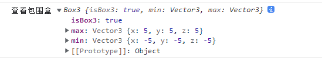
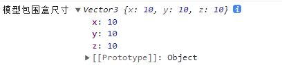
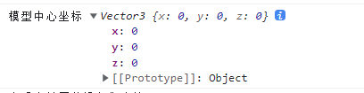

## 正投影相机
正投影相机和透视相机的区别
如果都以高处俯视去看整个场景，正投影相机就类似于2d的可视化的效果，透视相机就类似于人眼观察效果

#### 调整left, right, top, bottom范围大小
如果你想整体预览全部立方体，就需要调整相机的渲染范围，比如设置上下左右的范围。

使用场景：正投影可以用来预览中国地图，或者2D可视化的效果
透视投影相机一般是人在场景用漫游，或者高俯视整个

## 包围盒Box3
就是将整个模型的所有顶点包裹起来形成一个长方体，此长方体就是Box3
```js
    const geometry = new THREE.BoxGeometry(10, 10, 10);
    // 材质
    const material = new THREE.MeshPhysicalMaterial({
      color: 0x51efe4, //0x51efe4设置材质颜色
    });
    // 网络模型
    mesh = new THREE.Mesh(geometry, material);
    mesh.position.set(0, 0, 0);
    const box3 = new THREE.Box3();
    box3.expandByObject(mesh); // 计算模型包围盒
    console.log("查看包围盒", box3);
    scene.add(mesh);
```



#### 包围盒尺寸`.getSize()`
```js
    const scale = new THREE.Vector3();
    box3.getSize(scale);
    console.log("模型包围盒尺寸", scale);
```


#### 包围盒几何中心
```js
const scale = new THREE.Vector3();
box3.getCenter(center)
console.log('模型中心坐标', center);
```
